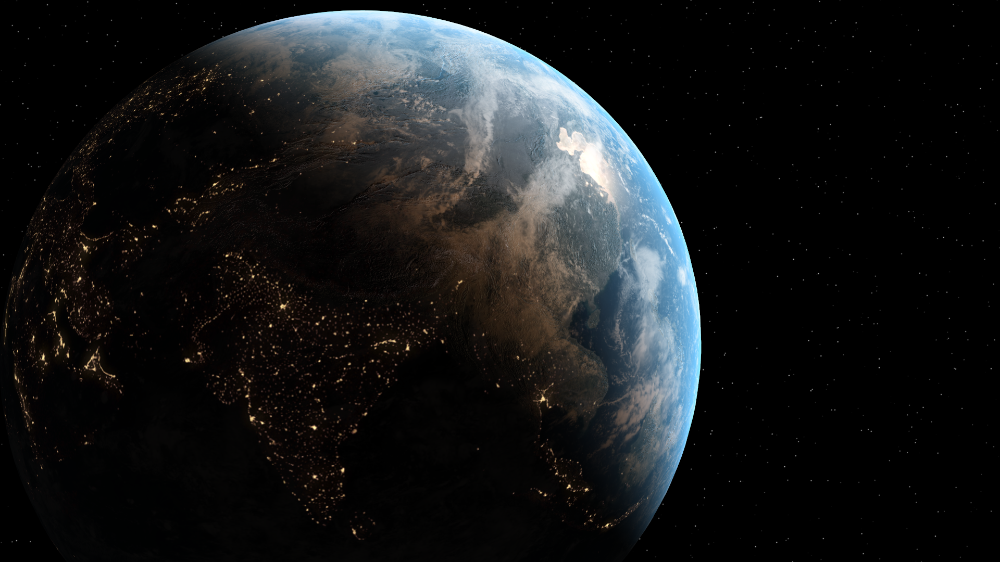

# GLSLEarth
## Earth Shader in Processing

>References:  
Textures: [VIDEO COPILOT ORB plug-in](https://www.videocopilot.net/orb/)  
Blog by christian: [Normal Mapping Without Precomputed Tangents](http://www.thetenthplanet.de/archives/1180)